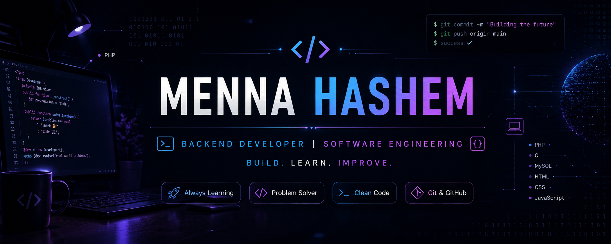

<div align="center">



<br><br>


</div>

---

# 👩‍💻 Developer Profile

<div align="center">


</div>

<br>

```yaml
Name: Menna Hashem

Role:
  - Backend Developer
  - Software Engineering Student

Education:
  - BATU

Experience:
  - Software Tester @ IT Club
  - Programming Trainee @ TCU

Currently Learning:
  - PHP
  - C
  - HTML
  - CSS
  - MySQL
  - Git
  - GitHub

Location:
  - Alexandria, Egypt
```

---

# ⚙️ Tech Stack

<p align="center">


</p>

---

# 📊 GitHub Stats

<p align="center">


</p>

<p align="center">


</p>

---

# 🏆 GitHub Trophies

<p align="center">


</p>

---

# 🌐 Connect With Me

<p align="center">

<a href="https://github.com/mennahashem96-bit">

</a>

&nbsp;&nbsp;

<a href="https://www.linkedin.com/in/menna-hashem-8387123aa">

</a>

&nbsp;&nbsp;

<a href="https://www.instagram.com/menna.hashem63">

</a>

</p>

---

<div align="center">


</div>

---

<div align="center">

### 💙 "Code • Learn • Build • Repeat"

</div> 
